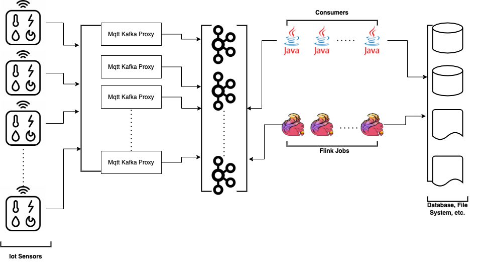

# workshop-2022

Bu çalışmamızda Iot sensör verilerinin Big Data araçlarıyla sisteme işlenmesi adına küçük bir örnek bulunmaktadır. Veri akışı aşağıdaki gibidir;

Sırasıyla aşağıdaki kurulum ve örneklere bakarak ilerleyebilirsiniz:

* [mqtt-kafka-proxy](/mqtt-kafka-proxy/README.md)
* [apache-kafka](/apache-kafka/README.md)
* [apache-flink](/apache-flink/README.md)
* [mqtt-kafka-consumer](/mqtt-kafka-consumer/README.md)